<div align="center">


#  Maison Sucrée
### *Artisan Pastry E-Commerce — Microservices Architecture*

[](https://dotnet.microsoft.com/)
[](https://learn.microsoft.com/aspnet/core)
[](https://www.microsoft.com/sql-server)
[](https://stripe.com)
[](https://jwt.io)
[](https://ocelot.readthedocs.io)
[](https://www.chartjs.org)

**A full-stack e-commerce platform for an artisan pastry shop, built on a microservices architecture.**
Browse products, manage your cart, apply coupons, and pay securely — all powered by 6 independent .NET services.

</div>

---

> [!NOTE]
> This is a demo project built to demonstrate microservices architecture, API Gateway routing, distributed JWT authentication, real-world Stripe payment integration, and an analytics admin dashboard with Chart.js.

---

## 📋 Table of Contents

- [🎯 Overview](#-overview)
- [📸 Screenshots](#-screenshots)
- [🏗️ Why Microservices?](#️-why-microservices)
- [🔀 Why Ocelot?](#-why-ocelot-api-gateway)
- [📐 Architecture](#-architecture)
- [⚙️ Services](#️-services)
- [🔐 Authentication & JWT](#-authentication--jwt)
- [🛡️ Security Decisions](#️-security-decisions)
- [✅ Form Validation](#-form-validation)
- [🗄️ Database Strategy](#️-database-strategy)
- [👥 Roles & Permissions](#-roles--permissions)
- [📊 Admin Dashboard](#-admin-dashboard)
- [🔄 Key Workflows](#-key-workflows)
- [🎨 UI & Design](#-ui--design)
- [🛠️ Tech Stack](#️-tech-stack)
- [📦 NuGet Packages](#-nuget-packages)
- [📁 Project Structure](#-project-structure)
- [🚀 Getting Started](#-getting-started)
- [🔑 Admin Access](#-admin-access)
- [🌐 Port Reference](#-port-reference)

---

## 🎯 Overview

**Maison Sucrée** is a demo microservices-based e-commerce platform for an artisan pastry shop. Customers browse handcrafted products, add items to a shopping cart, apply discount coupons, and complete purchases through Stripe-powered checkout. Administrators manage products, coupons, and the full order lifecycle from a dedicated analytics dashboard.

The application is decomposed into **6 independent microservices**, each owning its own database and communicating through a centralized **Ocelot API Gateway**. Authentication is handled via distributed **JWT tokens**, and payments are processed through **Stripe Checkout Sessions**.

---

## 📸 Screenshots

### 🛍️ Customer Flow

**Home — Product Grid**
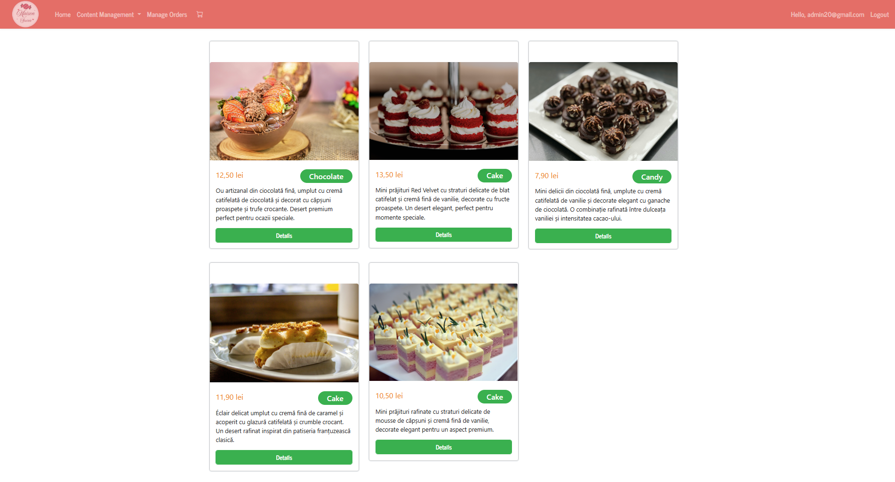

**Product Details**
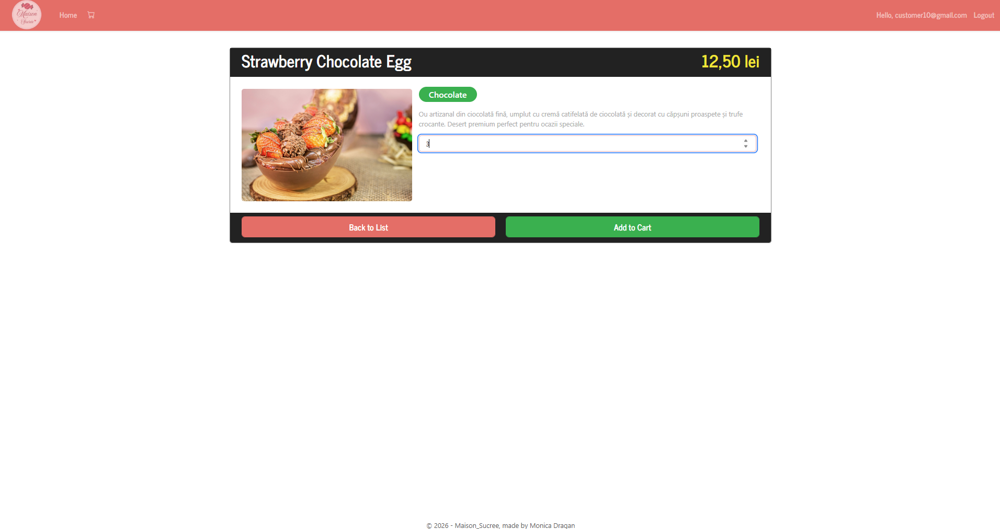

**Shopping Cart with Coupon Applied**
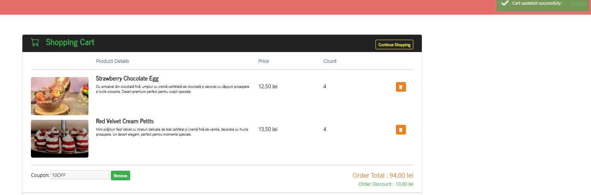

**Order Summary**
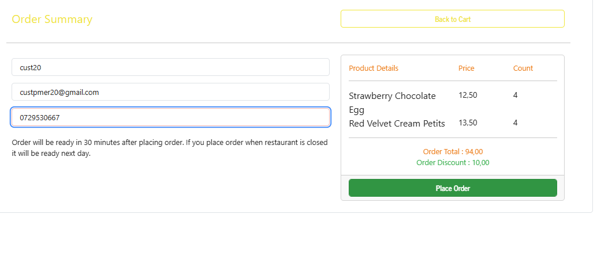

**Stripe Checkout**
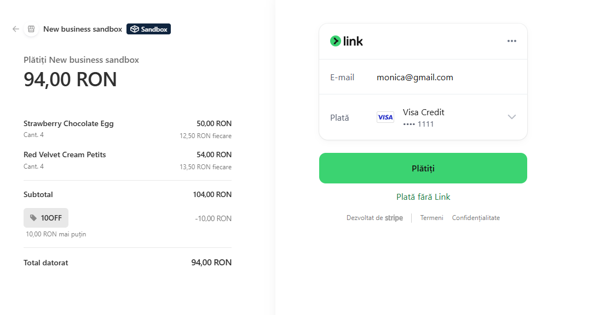

**Order Confirmation**
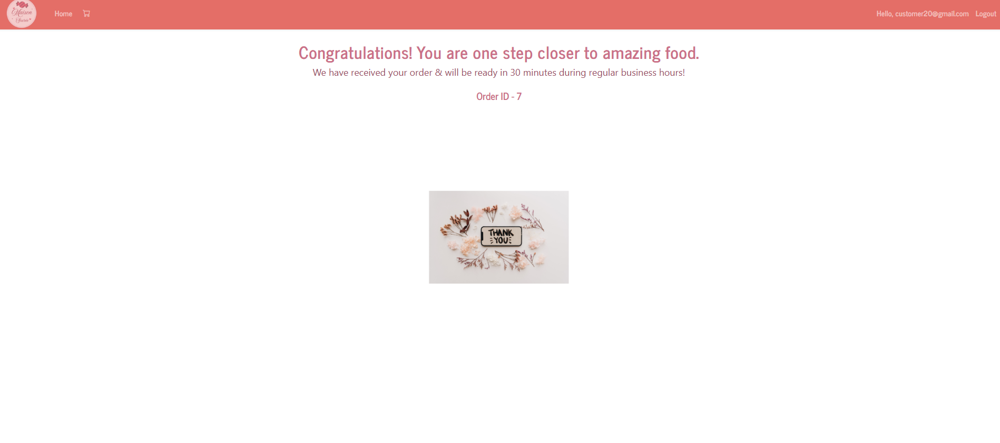

**Login — Registration Successful**
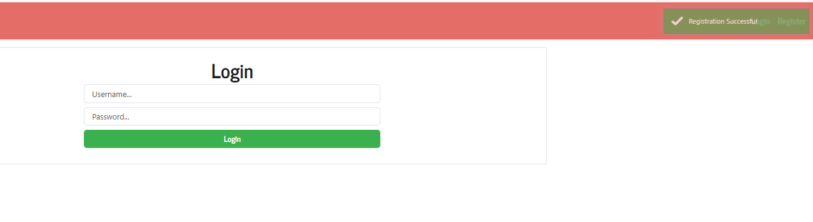

---

### 🔧 Admin Panel

**Admin Navigation**
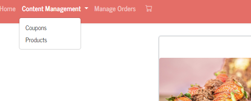

**Create Product**
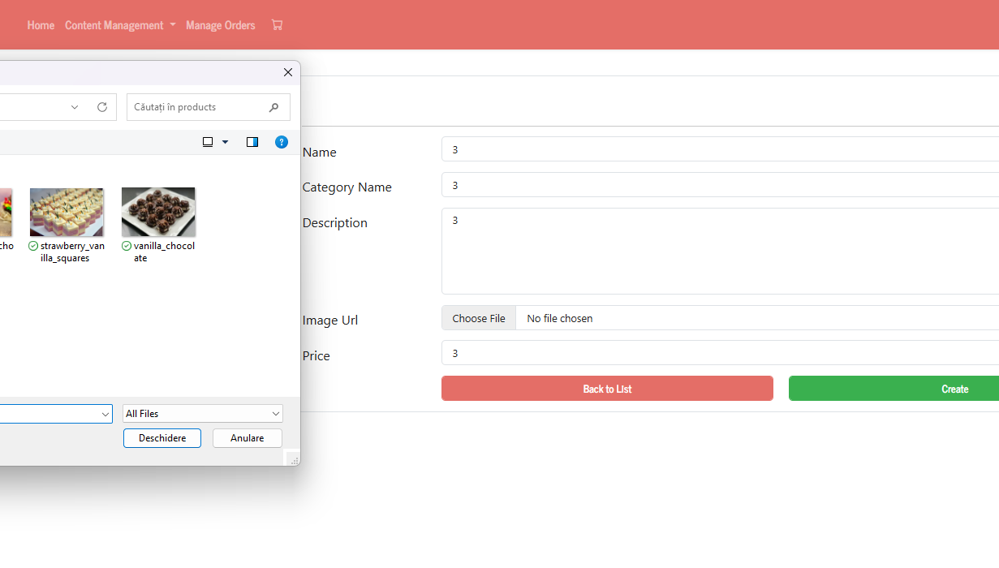

**Order List**
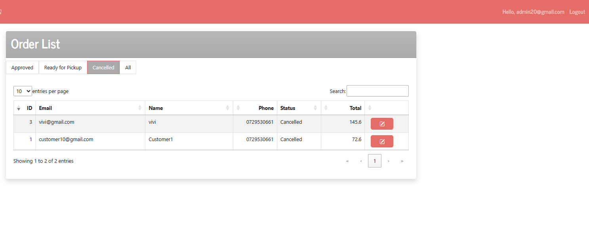

**Order Detail — Approved**
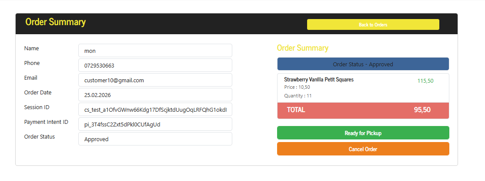

**Order Detail — Ready for Pickup**
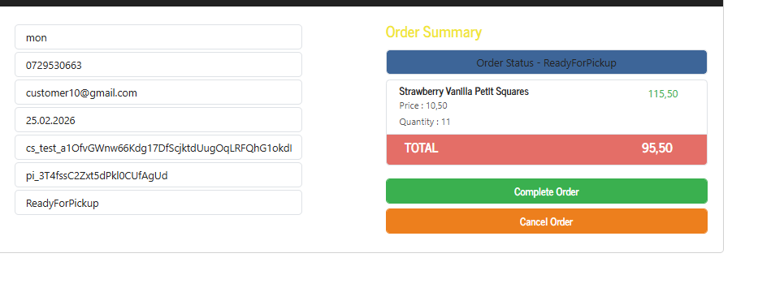

---

## 🏗️ Why Microservices?

A traditional **monolithic** application packs everything — authentication, products, cart, orders, payments — into a single deployable unit. This creates real problems at scale:

| Problem | Monolith | Microservices |
|---|---|---|
| **Failure impact** | One module crashes → everything goes down | One service fails → others keep running |
| **Scaling** | Must scale entire app for one busy feature | Scale only the service that needs it |
| **Deployments** | Every change = full rebuild + redeploy | Deploy only what changed |
| **Team independence** | Everyone touches the same codebase | Each service owned independently |

In Maison Sucrée, each service maps directly to a **bounded business domain**:

| Service | Business Domain |
|---|---|
| `AuthAPI` | Identity & access management |
| `ProductAPI` | Product catalog |
| `CouponAPI` | Discount & promotions |
| `ShoppingCartAPI` | Cart state management |
| `OrderAPI` | Order lifecycle & payments |

---

## 🔀 Why Ocelot (API Gateway)?

Without a gateway, the frontend would need to know the addresses of all 5 backend services and handle authentication separately for each one. Every port change or server migration would require frontend code changes.

**Ocelot** is an open-source .NET API Gateway — the **single entry point** for all API traffic. The Web frontend knows only one address (`https://localhost:7042`) and Ocelot handles the rest.

### What Ocelot does in this project

**Route mapping** — translates frontend requests to the correct downstream service:
```
GET  /api/product           →  ProductAPI      :7125
GET  /api/cart/GetCart/{id} →  ShoppingCartAPI :7214
POST /api/order/CreateOrder →  OrderAPI        :7227
POST /api/coupon            →  CouponAPI       :7077
```

**Centralized JWT validation** — protected routes declare `AuthenticationProviderKey: "Bearer"` in `ocelot.json`. Ocelot validates the token **once** before forwarding. Invalid tokens never reach downstream services.

**Abstraction** — moving a service to a different server requires changing only `ocelot.json`, not the frontend.

> [!NOTE]
> `AuthAPI` bypasses the gateway intentionally — the Web frontend calls it directly at port 7108 because authentication itself cannot require prior authentication.

---

## 📐 Architecture

```
┌─────────────────────────────────────────────────────────┐
│                     BROWSER / CLIENT                    │
└───────────────────────────┬─────────────────────────────┘
                            │
                            ▼
┌─────────────────────────────────────────────────────────┐
│            Maison_Sucree.Web  —  MVC  :7070             │
│    Controllers: Home · Cart · Product · Coupon · Order  │
│    ApiClient: typed HttpClient, injects JWT on every    │
│    request from the authentication cookie               │
└──────────────┬──────────────────────┬───────────────────┘
               │  /api/* requests     │  Auth only (direct)
               ▼                      ▼
┌──────────────────────┐   ┌──────────────────────────────┐
│   Ocelot Gateway     │   │         AuthAPI  :7108       │
│       :7042          │   │                              │
│  ✔ JWT validation    │   │  POST /api/auth/register     │
│  ✔ Route mapping     │   │  POST /api/auth/login        │
│  ✔ Abstraction       │   │  Admin seeded at startup     │
└──────┬───────────────┘   └──────────────────────────────┘
       │
  ┌────┴──────────────────────────────────────────┐
  │                                               │
  ▼            ▼              ▼            ▼
┌──────────┐ ┌──────────┐ ┌──────────┐ ┌──────────────┐
│ Product  │ │  Coupon  │ │Shopping  │ │    Order     │
│   API    │ │   API    │ │ Cart API │ │     API      │
│  :7125   │ │  :7077   │ │  :7214   │ │    :7227     │
└────┬─────┘ └────┬─────┘ └─────┬────┘ └──────┬───────┘
     │            │             │             │
     ▼            ▼             ▼             ▼
  ┌──────┐    ┌──────┐    ┌──────────┐   ┌──────┐    ┌─────────┐
  │ DB   │    │ DB   │    │    DB    │   │ DB   │    │ Stripe  │
  │Prod. │    │Coup. │    │   Cart   │   │Order │    │  API    │
  └──────┘    └──────┘    └──────────┘   └──────┘    └─────────┘
```

---

## ⚙️ Services

### 🔑 AuthAPI — Port 7108

The **identity backbone** of the platform. Uses ASP.NET Core Identity for user management and generates signed JWT tokens.

| Endpoint | Method | Description |
|---|---|---|
| `/api/auth/register` | POST | Creates user, assigns `CUSTOMER` role automatically |
| `/api/auth/login` | POST | Validates credentials, returns JWT (7 days) |

> [!IMPORTANT]
> On every startup, `SeedAdminUser()` in `Program.cs` checks if `admin@gmail.com` exists. If not, it creates the admin account with the `ADMIN` role automatically. The `AssignRole` endpoint was **removed entirely** to prevent privilege escalation — no one can self-assign a role.

---

### 🛍️ ProductAPI — Port 7125

Manages the product catalog. Products include name, description, price, category, and an image stored in `wwwroot/ProductImages/`.

| Endpoint | Auth Required | Role |
|---|---|---|
| `GET /api/product` | ❌ | Public |
| `GET /api/product/{id}` | ✅ | Any |
| `POST /api/product` | ✅ | ADMIN only |
| `PUT /api/product` | ✅ | ADMIN only |
| `DELETE /api/product/{id}` | ✅ | ADMIN only |

---

### 🎟️ CouponAPI — Port 7077

Manages discount coupons with code and discount amount.

| Endpoint | Auth Required | Role |
|---|---|---|
| `GET /api/coupon` | ❌ | Public |
| `GET /api/coupon/GetByCode/{code}` | ❌ | Public |
| `POST /api/coupon` | ✅ | ADMIN only |
| `DELETE /api/coupon/{id}` | ✅ | ADMIN only |

---

### 🛒 ShoppingCartAPI — Port 7214

The most complex service — manages cart state and **enriches data** by calling other services internally.

| Endpoint | Description |
|---|---|
| `GET /api/cart/GetCart/{userId}` | Cart with full product details |
| `POST /api/cart/CartUpsert` | Add item or update quantity |
| `POST /api/cart/RemoveCart` | Remove a cart item |
| `POST /api/cart/ApplyCoupon` | Validate & apply coupon code |
| `POST /api/cart/ClearCart` | Empty cart after order |

**Inter-service calls:** → **ProductAPI** for product details · → **CouponAPI** for coupon validation

---

### 📦 OrderAPI — Port 7227

Manages the full order lifecycle and **Stripe payment integration**.

| Endpoint | Description |
|---|---|
| `POST /api/order/CreateOrder` | Creates order record from cart |
| `POST /api/order/CreateStripeSession` | Creates hosted Stripe Checkout URL |
| `POST /api/order/ValidateStripeSession` | Confirms payment, updates status |
| `GET /api/order/GetOrders/{userId}` | User's order history |
| `POST /api/order/UpdateOrderStatus/{id}` | Admin status update |

**Order status flow:**
```
Pending → Approved → ReadyForPickup → Completed
                  ↘ Cancelled
```

---

## 🔐 Authentication & JWT

```
1. Login → AuthAPI creates JWT:
   Payload: { userId, email, name, role: "CUSTOMER" | "ADMIN" }
   Signed with: shared secret key
   Expiry: 7 days

2. Web stores JWT in auth cookie (10h session)

3. Every API request:
   ApiClient reads JWT from cookie
   Adds: Authorization: Bearer eyJhbGci...

4. Gateway: validates JWT → forwards if valid → 401 if not

5. Service-level: [Authorize(Roles = "ADMIN")] → 403 if not admin
```

---

## 🛡️ Security Decisions

Several deliberate security improvements were made during development:

**1. AssignRole endpoint removed**
The original `POST /api/auth/AssignRole` had no authentication requirement — any user could call it and self-assign the ADMIN role. This endpoint was **completely removed**.

**2. Admin hardcoded at startup**
The admin account (`admin@gmail.com`) is created via `SeedAdminUser()` in `Program.cs` on first run. It cannot be created through normal registration.

**3. Role auto-assignment on register**
Every new user who registers receives the `CUSTOMER` role automatically inside `AuthService.Register()`. No role selection is exposed in the registration form.

**4. Role dropdown removed from UI**
The register form no longer shows a role selector — users have no control over their role assignment.

---

## ✅ Form Validation

Registration form validates all fields with clear English error messages:

| Field | Rule | Error Message |
|---|---|---|
| Email | Valid email format | `Please enter a valid email address.` |
| Name | Letters, spaces, hyphens only — no digits or special chars | `Name can only contain letters, spaces and hyphens.` |
| Phone | Romanian format: `07XXXXXXXX` or `+40XXXXXXXXX` | `Please enter a valid Romanian phone number.` |
| Password | Required | `Password is required.` |

Validation is enforced at **two levels**:
- **Web DTO** — client-side via `_ValidationScriptsPartial`, errors shown instantly
- **AuthAPI DTO** — server-side, protects against direct API calls

---

## 🗄️ Database Strategy

Each microservice owns its **own isolated database** — the *Database per Service* pattern.

| Service | Database | Key Tables |
|---|---|---|
| AuthAPI | `Maison_Sucree_Auth` | AspNetUsers, AspNetRoles, AspNetUserRoles |
| ProductAPI | `Maison_Sucree_Product` | Products |
| CouponAPI | `Maison_Sucree_Coupon` | Coupons |
| ShoppingCartAPI | `Maison_Sucree_ShoppingCart` | CartHeaders, CartDetails |
| OrderAPI | `Maison_Sucree_Order` | OrderHeaders, OrderDetails |

All databases use SQL Server LocalDB. Each `Program.cs` calls `ApplyMigration()` on startup — databases are created automatically.

---

## 👥 Roles & Permissions

| Feature | Unauthenticated | CUSTOMER | ADMIN |
|---|:---:|:---:|:---:|
| Browse products | ✅ | ✅ | ✅ |
| View product details | ❌ | ✅ | ✅ |
| Add to cart | ❌ | ✅ | ✅ |
| Apply coupon | ❌ | ✅ | ✅ |
| Place order & pay | ❌ | ✅ | ✅ |
| View own orders | ❌ | ✅ | ✅ |
| Create / edit / delete products | ❌ | ❌ | ✅ |
| Create / delete coupons | ❌ | ❌ | ✅ |
| View & manage all orders | ❌ | ❌ | ✅ |
| Update order status | ❌ | ❌ | ✅ |
| Admin Analytics Dashboard | ❌ | ❌ | ✅ |

---

## 📊 Admin Dashboard

A demo business-style analytics dashboard accessible at `/Order/Dashboard` (ADMIN only), built with **Chart.js** and Bootstrap.

### Stat Cards
| Card | Calculation |
|---|---|
| 💰 Total Revenue | Sum of `OrderTotal` where Status = `Approved` or `Completed` |
| 📦 Total Orders | Count of all orders |
| 👥 Total Customers | Distinct `UserId` count across all orders |
| ⏳ Active Orders | Count where Status = `Approved` or `ReadyForPickup` |

### Charts
- **Donut chart** — order status distribution (Pending / Approved / ReadyForPickup / Completed / Cancelled)
- **Bar chart** — same data in bar format for quick comparison

### Recent Orders Table
Last 5 orders by `OrderHeaderId` descending, showing:
- Order ID, Customer name, Email, Total, Status badge, View link

Status badges are color-coded:
- 🟢 Approved · 🔵 Completed · 🟡 Ready for Pickup · 🔴 Cancelled · ⚫ Pending

---

## 🔄 Key Workflows

<details>
<summary><strong>📝 User Registration</strong></summary>

```
1. User fills Register form (name, email, phone, password)
   — Role dropdown NOT shown, assigned automatically
2. Client-side validation fires instantly (email, phone, name format)
3. Web → POST /api/auth/register (direct to AuthAPI :7108)
4. AuthAPI → UserManager.CreateAsync() → password hashed by Identity
5. Role "CUSTOMER" assigned automatically in AuthService
6. Redirect to Login with success message
```
</details>

<details>
<summary><strong>🔓 Login & Session</strong></summary>

```
1. User submits Login form (email + password)
2. Web → POST /api/auth/login → AuthAPI :7108
3. AuthAPI validates credentials → generates JWT (7 days)
   JWT payload: { userId, email, name, role }
4. Web → SignInAsync() creates auth cookie (10h)
5. Cookie attached automatically to every subsequent request
```
</details>

<details>
<summary><strong>🛒 Add to Cart</strong></summary>

```
1. User clicks "Add to Cart" on product details page
2. Web → POST :7042/api/cart/CartUpsert + Bearer token
3. Ocelot: validates JWT → routes to ShoppingCartAPI :7214
4. ShoppingCartAPI:
   - No CartHeader → INSERT CartHeader + CartDetails
   - Header exists, item exists → UPDATE Count
   - Header exists, new item → INSERT CartDetails
```
</details>

<details>
<summary><strong>💳 Checkout & Stripe Payment</strong></summary>

```
1. User clicks "Looks Good?" on cart page
2. POST /api/order/CreateOrder → OrderAPI
   → INSERT OrderHeader + OrderDetails
3. POST /api/order/CreateStripeSession → OrderAPI
   → Stripe.net SessionService.CreateAsync()
   → Returns hosted Stripe checkout URL
4. Browser redirected to Stripe → user enters card details
5. Stripe redirects to /order/Confirmation
6. POST /api/order/ValidateStripeSession
   → Stripe confirms payment → OrderStatus = "Approved"
   → CartAPI.ClearCart() removes all cart items
```
</details>

<details>
<summary><strong>📋 Order Management (Admin)</strong></summary>

```
1. Admin → "Manage Orders" in navbar
2. GET /api/order/GetOrders → all orders in DataTable
3. Filter: Approved / ReadyForPickup / Cancelled / All
4. Click order → update status:
   Approved → ReadyForPickup → Completed
                             → Cancelled (triggers Stripe refund)
5. POST /api/order/UpdateOrderStatus/{id}
```
</details>

---

## 🎨 UI & Design

The frontend uses a consistent **coral/rose** color theme (`#EB6864`) throughout.

### Product Listing Cards
- Product name displayed prominently in rose color
- Images fixed at `220px` height with `object-fit: cover` for uniform appearance
- All cards same height via CSS flexbox
- Category badge: rose outline (transparent background)
- Details button: rose outline with fill-on-hover
- Price: bold black (`#212529`) for readability

### Home Page
- Welcome banner with gradient background, brand name, and tagline
- Responsive 3-column product grid

### Navigation
- Cart icon visible only when authenticated (right side, near user name)
- Admin sees: Dashboard · Content Management · Manage Orders
- Customers see: Home only (+ cart when logged in)

### Footer
- Full-width, same color as navbar (`#EB6864`)
- White text, consistent across all pages
- `margin-top: 4rem` ensures spacing from page content on all screen sizes

### Product Details Page
- Light rose header background with product name and price in black

---

## 🛠️ Tech Stack

| Layer | Technology | Purpose |
|---|---|---|
| Language | C# 12 | All backend services |
| Runtime | .NET 8.0 | Web framework |
| Web Framework | ASP.NET Core MVC | Razor frontend (server-side rendering) |
| API Framework | ASP.NET Core Web API | All backend microservices |
| ORM | Entity Framework Core 8 | Database access & migrations |
| Database | SQL Server LocalDB | Local development storage |
| Authentication | ASP.NET Core Identity | User management & password hashing |
| Tokens | JWT Bearer (HS256) | Stateless distributed authentication |
| API Gateway | Ocelot 24.1.0 | Routing, JWT validation, abstraction |
| Payments | Stripe.net 50.3.0 | Checkout sessions & payment validation |
| Object Mapping | AutoMapper 12.0 | Entity ↔ DTO conversion |
| Charts | Chart.js 4.4.0 | Admin dashboard analytics |
| API Docs | Swagger / Swashbuckle | Interactive REST API documentation |
| Serialization | Newtonsoft.Json 13.0 | JSON handling across services |
| UI Framework | Bootstrap 5 | Responsive layout |
| Icons | Bootstrap Icons 1.13 | UI iconography |
| Data Tables | DataTables.net 2.3 | Admin order management table |

---

## 📦 NuGet Packages

<details>
<summary><strong>AuthAPI</strong></summary>

- `Microsoft.AspNetCore.Identity.EntityFrameworkCore`
- `Microsoft.EntityFrameworkCore.SqlServer`
- `Microsoft.AspNetCore.Authentication.JwtBearer`
- `System.IdentityModel.Tokens.Jwt`
- `Swashbuckle.AspNetCore`

</details>

<details>
<summary><strong>ProductAPI & CouponAPI</strong></summary>

- `AutoMapper`
- `Microsoft.EntityFrameworkCore.SqlServer`
- `Microsoft.AspNetCore.Authentication.JwtBearer`
- `Swashbuckle.AspNetCore`

</details>

<details>
<summary><strong>ShoppingCartAPI</strong></summary>

- `AutoMapper`
- `Microsoft.EntityFrameworkCore.SqlServer`
- `Microsoft.AspNetCore.Authentication.JwtBearer`
- `Newtonsoft.Json`

</details>

<details>
<summary><strong>OrderAPI</strong></summary>

- `Stripe.net`
- `AutoMapper`
- `Microsoft.EntityFrameworkCore.SqlServer`
- `Microsoft.AspNetCore.Authentication.JwtBearer`
- `Newtonsoft.Json`

</details>

<details>
<summary><strong>GatewaySolution</strong></summary>

- `Ocelot`
- `Microsoft.AspNetCore.Authentication.JwtBearer`

</details>

<details>
<summary><strong>Web (MVC Frontend)</strong></summary>

- `Microsoft.AspNetCore.Authentication.Cookies`
- `Newtonsoft.Json`

</details>

---

## 📁 Project Structure

```
Maison_Sucree/
│
├── Maison_Sucree.Web/                        # MVC Frontend  :7070
│   ├── Controllers/
│   │   ├── HomeController.cs                # Product listing, product details
│   │   ├── AuthController.cs                # Login, Register, Logout
│   │   ├── CartController.cs                # Cart, Checkout, Confirmation
│   │   ├── ProductController.cs             # Admin: product CRUD
│   │   ├── CouponController.cs              # Admin: coupon CRUD
│   │   └── OrderController.cs               # Order list, detail, Dashboard
│   ├── Models/
│   │   ├── AdminDashboardViewModel.cs       # Stats + chart data + recent orders
│   │   ├── OrderHeaderDto.cs
│   │   ├── OrderDetailsDto.cs
│   │   ├── RegistrationRequestDto.cs        # With email/phone/name validation
│   │   └── ...
│   ├── Service/
│   │   ├── BaseService.cs                   # Generic SendAsync + JWT injection
│   │   ├── AuthService.cs                   # → AuthAPI
│   │   ├── ProductService.cs                # → ProductAPI via Gateway
│   │   ├── CartService.cs                   # → ShoppingCartAPI via Gateway
│   │   ├── CouponService.cs                 # → CouponAPI via Gateway
│   │   └── OrderService.cs                  # → OrderAPI via Gateway
│   ├── Views/
│   │   ├── Home/
│   │   │   ├── Index.cshtml                 # Banner + product grid (equal-height cards)
│   │   │   └── ProductDetails.cshtml        # Product detail + Add to Cart
│   │   ├── Auth/                            # Login, Register (no role dropdown)
│   │   ├── Cart/                            # Index (no Email Cart btn), Checkout, Confirmation
│   │   ├── Product/                         # Admin CRUD views
│   │   ├── Coupon/                          # Admin CRUD views
│   │   ├── Order/
│   │   │   ├── Index.cshtml                 # Orders DataTable with status filters
│   │   │   ├── OrderDetail.cshtml           # Order detail + status update
│   │   │   └── Dashboard.cshtml             # Admin analytics dashboard (Chart.js)
│   │   └── Shared/
│   │       ├── _Layout.cshtml               # Navbar: Dashboard link for admin
│   │       └── _Notifications.cshtml
│   └── Utility/
│       └── SD.cs                            # Role constants, status constants, API URLs
│
├── Maison_Sucree.GatewaySolution/            # API Gateway  :7042
│   ├── ocelot.json                          # All route definitions
│   └── Extensions/WebApplicationBuilderExtensions.cs
│
├── Maison_Sucree.Services.AuthAPI/           # Auth Service  :7108
│   ├── Controllers/AuthAPIController.cs     # register + login only (AssignRole removed)
│   ├── Service/
│   │   ├── AuthService.cs                   # Auto-assigns CUSTOMER on register
│   │   └── JwtTokenGenerator.cs
│   ├── Models/
│   │   └── Dto/RegistrationRequestDto.cs    # Server-side validation
│   ├── Program.cs                           # SeedAdminUser() on startup
│   └── Data/AppDbContext.cs
│
├── Maison_Sucree.Services.ProductAPI/        # Product Service  :7125
├── Maison_Sucree.Services.CouponAPI/         # Coupon Service  :7077
├── Maison_Sucree.Services.ShoppingCartAPI/   # Cart Service  :7214
└── Maison_Sucree.Services.OrderAPI/          # Order Service  :7227
```

---

## 🚀 Getting Started

### Prerequisites

- Visual Studio 2022+
- .NET 8.0 SDK
- SQL Server LocalDB *(included with Visual Studio)*
- Stripe account *(test mode — no real charges)*

### 1. Clone the repository

```bash
git clone https://github.com/DraganMonica/maison_sucree_microservices.git
cd maison_sucree_microservices/Maison_Sucree
```

### 2. Configure `appsettings.json` in each service

Each service needs a valid `ConnectionStrings:DefaultConnection`:

```json
"ConnectionStrings": {
  "DefaultConnection": "Server=(localdb)\\mssqllocaldb;Database=Maison_Sucree_Auth;Trusted_Connection=True;TrustServerCertificate=True;"
}
```

Database names per service:
`Maison_Sucree_Auth` · `Maison_Sucree_Product` · `Maison_Sucree_Coupon` · `Maison_Sucree_ShoppingCart` · `Maison_Sucree_Order`

**AuthAPI** — JWT configuration:
```json
"ApiSettings": {
  "JwtOptions": {
    "Secret": "your-secret-key-minimum-32-characters",
    "Issuer": "maisonsucree-auth-api",
    "Audience": "maisonsucre-client"
  }
}
```

**OrderAPI** — Stripe keys:
```json
"Stripe": {
  "SecretKey": "sk_test_..."
}
```

### 3. Set Multiple Startup Projects

Right-click **Solution** → **Set Startup Projects** → **Multiple startup projects** → set all 7 to **Start**:

```
✅ Maison_Sucree.GatewaySolution
✅ Maison_Sucree.Services.AuthAPI
✅ Maison_Sucree.Services.ProductAPI
✅ Maison_Sucree.Services.CouponAPI
✅ Maison_Sucree.Services.ShoppingCartAPI
✅ Maison_Sucree.Services.OrderAPI
✅ Maison_Sucree.Web
```

### 4. Run

Press **F5**. All services start simultaneously. Databases are created and migrated automatically. Admin user is seeded on first run — no manual steps needed.

### 5. Open the app

```
https://localhost:7070
```

> [!NOTE]
> To test Stripe payments use card number `4242 4242 4242 4242`, any future expiry date, any 3-digit CVC, and a valid email on the Stripe checkout page.

---

## 🔑 Admin Access

> [!IMPORTANT]
> The admin account is **hardcoded and seeded at startup** via `SeedAdminUser()` in `Program.cs`. It cannot be created through normal registration. The role assignment endpoint was removed for security.

```
Email:     admin@gmail.com
Password:  Admin@123!
```

After logging in as admin, the navbar shows:
- **Dashboard** → analytics overview with charts and stats
- **Content Management** → Products, Coupons
- **Manage Orders** → full order lifecycle with status updates

---

## 🌐 Port Reference

| Service | HTTP | HTTPS |
|---|:---:|:---:|
| 🌐 Web (MVC Frontend) | 5285 | **7070** |
| 🔀 API Gateway (Ocelot) | 5069 | **7042** |
| 🔑 AuthAPI | 5283 | **7108** |
| 🛍️ ProductAPI | 5077 | **7125** |
| 🎟️ CouponAPI | 5006 | **7077** |
| 🛒 ShoppingCartAPI | 5191 | **7214** |
| 📦 OrderAPI | 5075 | **7227** |

> [!NOTE]
> Access the application at `https://localhost:7070`.
> Opening `https://localhost:7042` directly in the browser returns **404** — this is expected. The gateway only handles `/api/*` routes, not page requests.

---

<div align="center">

© 2026 — Maison Sucrée · Made by **Monica Dragan**

</div>
